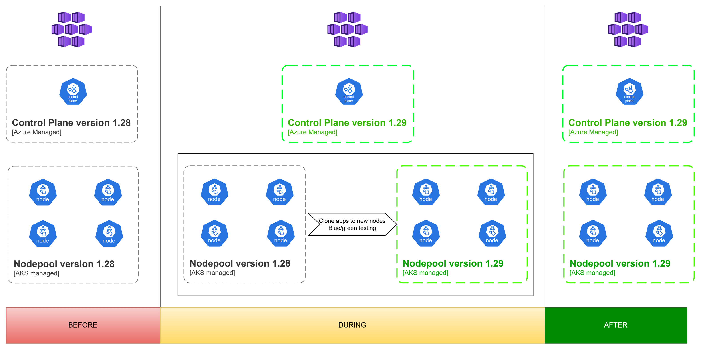

# 🚀 Upgrading Kubernetes (AKS) Clusters Without/Minimizing Downtime  

## 👨‍💻 Author  

**Vo The Minh**  

- 🌐 **GitHub**: [https://github.com/18120211](https://github.com/18120211)  
- 💼 **LinkedIn**: [https://www.linkedin.com/in/minh-vo-108643118/](https://www.linkedin.com/in/minh-vo-108643118/)  
- 📧 **Email**: minhthevo123@gmail.com 

🚀 Passionate about **Kubernetes, DevOps, and Cloud Engineering**. Always learning and sharing knowledge!  
Feel free to connect! 😊 

## 📖 Table of Contents  

- [🔍 Overview](#overview)  
- [📚 Key Concepts](#key-concepts)  
- [🔄 Workflow and Implementation](#workflow-and-implementation)  
- [🎯 Conclusion](#conclusions)  
- [📚 References](#references)  


## 📌 Overview  <a id="overview"></a>  

Upgrading an **Azure Kubernetes Service (AKS) cluster** can be challenging, especially when aiming to **avoid or minimize downtime** for applications. A traditional in-place upgrade of worker nodes can lead to disruptions, as workloads need to be drained and rescheduled.  

This portfolio outlines a **safe and reliable upgrade strategy** by:  
1. **Upgrading the control plane first** to ensure compatibility with new Kubernetes features.  
2. **Creating a new worker node pool** instead of upgrading existing nodes, preventing disruptions.  
3. **Using a Blue-Green deployment approach** to gradually migrate workloads from the old node pool to the new version.  
4. **Repeating the process until all workloads are migrated**, followed by **post-upgrade checks and verification**.  

By following this method, the upgrade is performed **gradually and with minimal impact** on running applications, ensuring high availability and reliability.  

$~$

## 🔑 Key Concepts  <a id="key-concepts"></a>  

### 1️⃣ **Kubernetes Control Plane Upgrade**  
The **control plane** is responsible for managing the cluster, including scheduling, scaling, and networking. Upgrading it first ensures compatibility with the newer worker nodes before workloads are moved.  

### 2️⃣ **Node Pools & Rolling Upgrades**  
Instead of **upgrading existing nodes**, we create a **new node pool** running the upgraded Kubernetes version. This prevents disruptions since old nodes remain operational while new nodes are provisioned.  

### 3️⃣ **Blue-Green Deployment Strategy**  
A **Blue-Green deployment** is used to **gradually shift workloads** from the **old node pool (Blue)** to the **new node pool (Green)**, ensuring:  
- **Zero downtime** by keeping both pools active during the transition.  
- **Rollback capability** if issues arise in the new node pool.  

### 4️⃣ **Workload Migration**  
- Applications are **moved incrementally** from the old node pool to the new node pool.  
- Traffic is **gradually shifted** to new nodes via **load balancing and pod rescheduling**.  

### 5️⃣ **Post-Upgrade Verification**  
After the migration is complete, we perform **checks to validate**:  
✅ Application availability and performance.  
✅ Logs and monitoring metrics for anomalies.  
✅ Node and cluster health status.  

By **systematically upgrading AKS clusters** in this way, we achieve a **smooth transition with minimal risk and downtime**. 🚀  

$~$

## 🔄 Workflow and Implementation <a id="workflow-and-implementation"></a>  


This **workflow outlines the step-by-step process** for upgrading an AKS cluster **without/minimizing downtime** by using a **Blue-Green Deployment Strategy** and **node pool migration**.  

---

### **1️⃣ Upgrade the Control Plane**  
- Upgrade the **AKS control plane** to the target Kubernetes version.  
- Ensure **no breaking changes** occur before updating worker nodes.  
- Validate the upgrade by checking API server availability and cluster components.  
    ```bash
    az aks upgrade -n [cluster_name] -g [resource_group] -k [kubernetes-version] --control-plane-only
    ```
---

### **2️⃣ Create a New Node Pool with the Upgraded Version**  
- Instead of upgrading existing worker nodes, create a **new node pool** with the latest Kubernetes version.  
- Ensure the **new pool matches the required compute resources** (VM size, scaling policies).  
- Deploy new nodes in **multiple availability zones** for resilience.  
    ```bash
    az aks nodepool add --cluster-name [cluster-name]
                        --name [name]
                        --resource-group [resource-group]
    ```
---

### **3️⃣ Migrate Workloads Using Blue-Green Deployment**  
- The **Blue node pool** (Old Kubernetes version) remains active, handling workloads.  
- The **Green node pool** (New Kubernetes version) is prepared for application migration.  
- Use **Pod Anti-Affinity Rules** to prevent immediate scheduling on the new pool.  

#### **Step-by-Step Migration Process:**  
1. **Taint the old (Blue) nodes** to prevent new workloads from scheduling there.  
    ```sh
    kubectl taint nodes <blue-node> key=value:NoSchedule
    ```

2. **Rolling out restart each applications** to move workloads to the new (Green) pool.
    ```sh
    kubectl rollout restart <deploy>/<ds>/<sts> <application_name>
    ```

3. **Verify pod distribution** in the new node pool using:
    ```sh
    kubectl get pods -o wide
    ```
4. **Monitor logs, metrics, and alerts** to confirm stability.
    
---

### **4️⃣ Repeat Until All Workloads Are Migrated**
* Continue migrating workloads until all applications run on the **new node pool**.
* Decommission the old node pool **only after validation**.

### **5️⃣ Post-Upgrade Verification**
* Run **integration and end-to-end tests** to validate services.
* Ensure **monitoring tools (Azure Monitor, Prometheus)** report normal metrics.
* Perform a **final check of networking, security, and storage components**.
* Remove the **old (Blue) node pool** once stability is confirmed.
    ```sh
    az aks nodepool delete --resource-group <rg-name> --cluster-name <aks-name> --name <blue-nodepool>
    ```

$~$

## 🎯 Conclusion <a id="conclusions"></a>  

Upgrading **Azure Kubernetes Service (AKS) clusters** without/minimizing downtime is critical for maintaining application availability and performance. By using a **Blue-Green Deployment Strategy**, new node pools, and a step-by-step migration approach, we ensure:  

✅ **Minimal service disruption** – Workloads gradually transition from old to new nodes.  
✅ **Rollback safety** – The old node pool remains available until migration is validated.  
✅ **Automation and efficiency** – Infrastructure as Code (Terraform) and CI/CD pipelines streamline the process.  
✅ **Improved observability** – Monitoring and logging tools ensure stability before and after the upgrade.  

By following this structured approach, organizations can **safely upgrade AKS clusters** while maintaining high availability and operational efficiency. 🚀  

$~$

## 📚 References <a id="references"></a>  

- [Azure Kubernetes Service (AKS) Documentation](https://learn.microsoft.com/en-us/azure/aks/)  
- [Kubernetes Upgrades Best Practices](https://kubernetes.io/docs/tasks/administer-cluster/kubeadm/kubeadm-upgrade/)  
- [Terraform AKS Module](https://registry.terraform.io/modules/Azure/aks/azurerm/latest)  
- [Blue-Green Deployment Strategy](https://martinfowler.com/bliki/BlueGreenDeployment.html)  
- [Azure Monitor for Containers](https://learn.microsoft.com/en-us/azure/azure-monitor/containers/container-insights-overview)  

📌 **For further learning, explore the above references to enhance your Kubernetes upgrade strategies.**  
