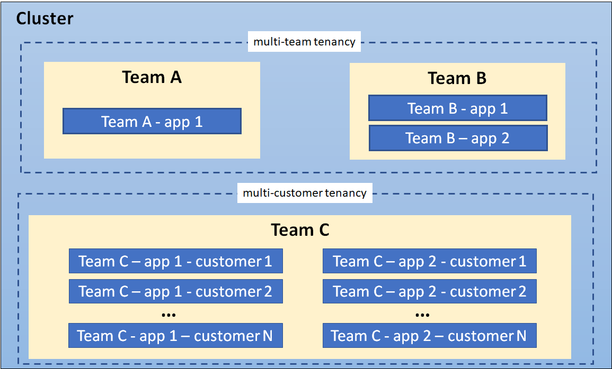
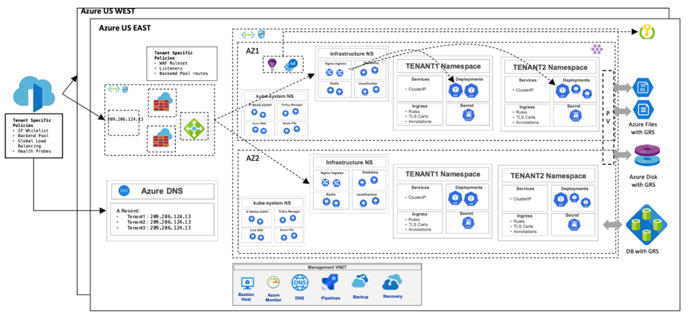
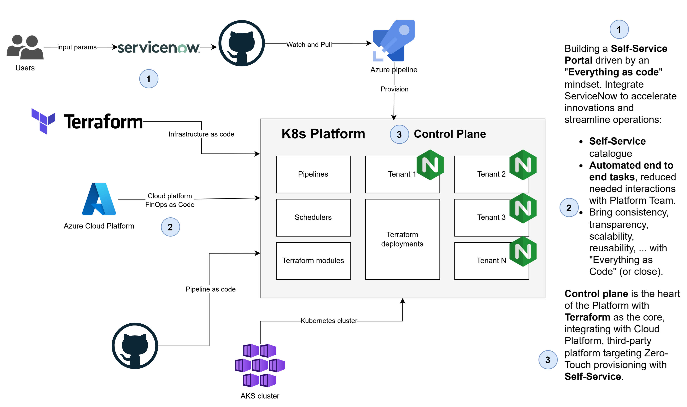
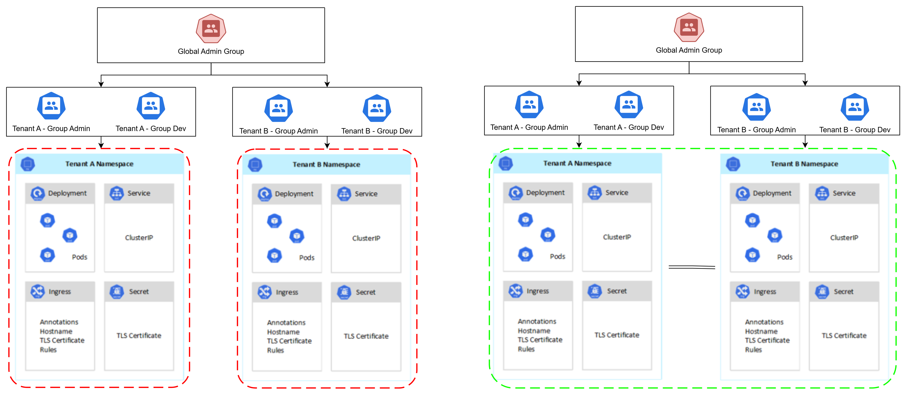
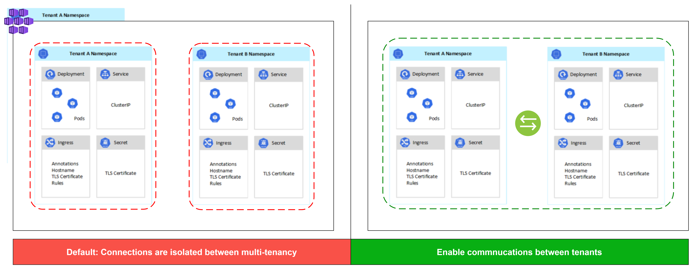

# 🚀 Kubernetes Multi-Tenancy on Azure with ServiceNow, Azure DevOps, and Terraform

## 👨‍💻 Author  

**Vo The Minh**  

- 🌐 **GitHub**: [https://github.com/18120211](https://github.com/18120211)  
- 💼 **LinkedIn**: [https://www.linkedin.com/in/minh-vo-108643118/](https://www.linkedin.com/in/minh-vo-108643118/)  
- 📧 **Email**: minhthevo123@gmail.com 

🚀 Passionate about **Kubernetes, DevOps, and Cloud Engineering**. Always learning and sharing knowledge!  
Feel free to connect! 😊 

## 📖 Table of Contents
  - [📌 Overview  ](#overview)
  - [🏷 Key Concepts  ](#key-concepts)
    - [Multi-Tenancy in Kubernetes](#multi-tenancy-in-kubernetes)
    - [ServiceNow for Request Management](#servicenow-for-request-management)
    - [GitHub as the Configuration Source](#github-as-the-configuration-source)
    - [Azure Pipelines for Automation](#azure-pipelines-for-automation)
    - [Terraform for Infrastructure as Code](#terraform-for-infrastructure-as-code)
  - [🏗 Architecture  ](#architecture)
    - [High-Level Workflow](#high-level-workflow)
    - [Key Components](#key-components)
  - [🔧 Technologies Used ](#technologies-used-)
  - [🔄 Workflow ](#workflow-)
  - [🚀 Implementation  ](#implementation)
    - [Step 1: Prepare Tenant Configuration in GitHub](#step-1-prepare-tenant-configuration-in-github)
    - [Step 2: ServiceNow Ticket Creation](#step-2-servicenow-ticket-creation)
    - [Step 3: Azure Pipeline Execution](#step-3-azure-pipeline-execution)
    - [Step 4: Terraform for Infrastructure as Code](#step-4-terraform-for-infrastructure-as-code)
  - [🔐 Security and Access Control  ](#security-and-access-control)
    - [Role-Based Access Control (RBAC)](#role-based-access-control-rbac)
    - [Network Policies](#network-policies)
    - [Secrets Management](#secrets-management)
  - [📊 Monitoring and Logging](#monitoring-and-logging)
    - [Azure Monitor](#azure-monitor)
    - [Prometheus \& Grafana](#prometheus--grafana)
    - [Azure Log Analytics](#azure-log-analytics)
    - [Fluentd for Centralized Logging](#fluentd-for-centralized-logging)
    - [Alerts and Notifications](#alerts-and-notifications)
  - [📌 What's Included](#whats-included)
  - [🎯 Conclusion](#conclusion)
  - [📚 References](#references)

## 📌 Overview  <a id="overview"></a>  


This project demonstrates a **multi-tenancy architecture on Azure Kubernetes Service (AKS)**, where each tenant operates in an **isolated namespace** with controlled access, resource quotas, and network policies.  

The onboarding process is **fully automated** using:  

- **ServiceNow** → Users submit a request to onboard a new tenant.  
- **GitHub** → Stores tenant configurations.  
- **Azure DevOps Pipelines** → Triggers automated tenant provisioning.  
- **Terraform** → Defines infrastructure as code to create namespaces, RBAC roles, and policies.  

This approach ensures **secure, scalable, and efficient management of multiple tenants** in a **single AKS cluster**, reducing operational overhead while maintaining compliance and security.  


$~$

## 🏷 Key Concepts  <a id="key-concepts"></a>  
### 1️⃣ **Multi-Tenancy in Kubernetes**: <a id="multi-tenancy-in-kubernetes"></a>
Multi-tenancy in AKS allows multiple teams or customers to share the same cluster while maintaining **isolation** through **namespaces, RBAC, and network policies**.  

### 2️⃣ **ServiceNow for Request Management**: <a id="servicenow-for-request-management"></a>  
ServiceNow is used to **initiate the tenant onboarding process**, ensuring proper approvals and tracking.  

### 3️⃣ **GitHub as the Configuration Source**: <a id="github-as-the-configuration-source"></a>  
Each tenant’s **namespace, resource quotas, and network policies** are predefined in a **GitHub repository** as YAML files.  

### 4️⃣ **Azure Pipelines for Automation**: <a id="azure-pipelines-for-automation"></a>  An **Azure DevOps Pipeline** is triggered upon a **new ServiceNow request**, automating the provisioning process.  

### 5️⃣ **Terraform for Infrastructure as Code**: <a id="terraform-for-infrastructure-as-code"></a>  
Terraform is used to **declare and manage Kubernetes resources**, ensuring consistency and repeatability.  

$~$

## 🏗 Architecture  <a id="architecture"></a>  


### 🔹 **High-Level Workflow** <a id="high-level-workflow"></a>  
1. **A user raises a ServiceNow request** to onboard a new tenant (namespace) in AKS.  
2. **The request triggers an Azure DevOps Pipeline**, fetching the tenant’s configuration from **GitHub**.  
3. **Terraform provisions the new tenant** by:  
   - Creating a **namespace** in AKS.  
   - Applying **resource quotas** to limit CPU/memory usage.  
   - Configuring **network policies** to ensure isolation.  
   - Assigning **RBAC roles** to control access.  
4. **Monitoring & logging are enabled** for visibility and security.  

### 🔹 **Key Components** <a id="key-components"></a>
| Component        | Description |
|-----------------|-------------|
| **ServiceNow**  | Ticketing system for tenant requests. |
| **GitHub**      | Stores tenant configurations as YAML files. |
| **Azure DevOps** | Automates tenant provisioning with pipelines. |
| **Terraform**   | Manages namespaces, quotas, and policies in AKS. |
| **AKS**         | Multi-tenant Kubernetes cluster. |
| **Azure Monitor & Logging** | Provides observability for tenant activity. |

This architecture ensures **efficient, secure, and automated multi-tenancy management** on AKS. 🚀  

$~$

## 🔧 Technologies Used <a id="technologies-used"></a>  
| Technology       | Purpose |
|------------------|---------|
| **Azure Kubernetes Service (AKS)** | Hosts the multi-tenant Kubernetes cluster. |
| **ServiceNow** | Handles user requests for tenant onboarding. |
| **GitHub** | Stores tenant configurations as YAML files. |
| **Azure DevOps Pipelines** | Automates the provisioning process. |
| **Terraform** | Manages infrastructure as code (IaC). |
| **Azure RBAC** | Controls access for different tenants. |
| **Kubernetes Network Policies** | Ensures network isolation between tenants. |
| **Azure Key Vault** | Securely stores sensitive credentials. |
| **Azure Monitor & Logging** | Tracks tenant activity and performance. |

$~$

## 🔄 Workflow <a id="workflow"></a>  



1. **A user submits a ServiceNow request** to onboard a new tenant (namespace) in AKS.
2. **The request triggers an Azure DevOps Pipeline**, fetching the tenant configuration from **GitHub**.
3. **Terraform provisions the new tenant** by:  
   - Creating a **namespace** in AKS.  
   - Setting up **resource quotas** for CPU and memory limits.  
   - Configuring **network policies** for security and isolation.  
   - Assigning **RBAC roles** to control tenant access.  
4. **Monitoring and logging are enabled** for tracking tenant activity.  

$~$

## 🚀 Implementation  <a id="implementation"></a>  

### Step 1: Prepare Tenant Configuration in GitHub  
Each tenant has a predefined configuration stored as a YAML file in **GitHub**:  
```yaml
# tenants/tenant1.yaml
tenant_name: "tenant1"
namespace: "tenant1-namespace"
resource_quota:
  cpu: "2"
  memory: "4Gi"
network_policies:
  allow_internet: false
  allow_internal_services: true
rbac_roles:
  - name: "tenant-admin"
    role: "admin"
    users:
      - "user1@example.com"
      - "user2@example.com"
```

---

### Step 2: ServiceNow Ticket Creation
A user raises a **ServiceNow** ticket requesting a new tenant.
The ticket triggers an **Azure DevOps Pipeline** (via webhook or scheduled job).

---
### Step 3: Azure Pipeline Execution
An **Azure DevOps Pipeline** provisions the tenant using Terraform.
```yaml
trigger:
  branches:
    include:
      - main

stages:
- stage: Deploy_Tenant
  jobs:
  - job: Terraform
    pool:
      vmImage: 'ubuntu-latest'
    steps:
    - checkout: self

    - task: TerraformInstaller@0
      inputs:
        terraformVersion: '1.5.0'

    - task: TerraformTaskV2@2
      inputs:
        provider: 'azurerm'
        command: 'apply'
        workingDirectory: '$(System.DefaultWorkingDirectory)/terraform'
        environmentServiceNameAzureRM: 'AzureServiceConnection'
```

---

### Step 4: Terraform for Infrastructure as Code
Terraform provisions the **namespace, resource quotas, network policies, and RBAC roles** for the new tenant.
```hcl
resource "kubernetes_namespace" "tenant" {
  metadata {
    name = var.tenant_name
  }
}

resource "kubernetes_resource_quota" "tenant_quota" {
  metadata {
    name      = "quota-${var.tenant_name}"
    namespace = kubernetes_namespace.tenant.metadata.0.name
  }

  spec {
    hard = {
      "cpu"    = var.cpu_limit
      "memory" = var.memory_limit
    }
  }
}

resource "kubernetes_network_policy" "deny_all" {
  metadata {
    name      = "deny-all-${var.tenant_name}"
    namespace = kubernetes_namespace.tenant.metadata.0.name
  }
  spec {
    pod_selector {}
    policy_types = ["Ingress", "Egress"]
  }
}
```

$~$


## 🔐 Security and Access Control  <a id="security-and-access-control"></a>  
Ensuring proper security and access control is crucial for a multi-tenant AKS environment.  

### 🔹 Role-Based Access Control (RBAC) <a id="role-based-access-control-rbac"></a>


RBAC is implemented to restrict access to tenant resources. Each tenant has specific roles assigned based on their responsibilities.  

Example **RBAC role binding** for tenant admins:  

```yaml
apiVersion: rbac.authorization.k8s.io/v1
kind: RoleBinding
metadata:
  name: tenant1-admin-binding
  namespace: tenant1-namespace
subjects:
  - kind: User
    name: user1@example.com
    apiGroup: rbac.authorization.k8s.io
  - kind: User
    name: user2@example.com
    apiGroup: rbac.authorization.k8s.io
roleRef:
  kind: Role
  name: admin
  apiGroup: rbac.authorization.k8s.io
```

---

### 🔹 Network Policies <a id="network-policies"></a>


Network policies ensure proper isolation between tenants. Each tenant is restricted to its own namespace.

Example **deny all external traffic** policy:
```yaml
apiVersion: networking.k8s.io/v1
kind: NetworkPolicy
metadata:
  name: deny-all
  namespace: tenant1-namespace
spec:
  podSelector: {}
  policyTypes:
    - Ingress
    - Egress
```

---

### 🔹 Secrets Management <a id="secrets-management"></a>
- **Azure Key Vault** is used to store sensitive credentials and API keys securely.
- Kubernetes Secrets store application-specific credentials.
Example **storing a database password in Azure Key Vault**:
```bash
az keyvault secret set --vault-name my-keyvault --name "DBPassword" --value "SuperSecretPass!"
```

$~$

## 📊 Monitoring and Logging  <a id="monitoring-and-logging"></a>  
Monitoring and logging are essential for tracking tenant activity, identifying performance issues, and ensuring security compliance in a multi-tenant **AKS** environment.  

### 🔹 Azure Monitor <a id="azure-monitor"></a>
**Azure Monitor** provides a centralized platform for collecting and analyzing performance metrics and logs from AKS.  

✅ **Features:**  
- **Real-time monitoring of AKS clusters and workloads**  
- **Integration with Azure Log Analytics for log querying**  
- **Custom dashboards for tracking tenant-specific metrics**  

Example **Azure CLI command** to enable monitoring on an AKS cluster:  

```bash
az aks update --resource-group myResourceGroup --name myAKSCluster --enable-addons monitoring
```

---

### 🔹 Prometheus & Grafana <a id="prometheus--grafana"></a>
**Prometheus** is used for collecting metrics from Kubernetes, and Grafana provides visual dashboards for analysis.

✅ **Features**:
- **Tenant-specific resource usage tracking**
- **Real-time alerts for performance degradation**
- **Custom dashboards for CPU, memory, and network usage**

Example Prometheus configuration to scrape AKS metrics:
```yaml
global:
  scrape_interval: 15s

scrape_configs:
  - job_name: 'kubernetes'
    static_configs:
      - targets: ['kubernetes.default.svc.cluster.local:443']
```

To deploy **Grafana** in AKS:
```bash
helm install grafana grafana/grafana --namespace monitoring
```

---

### 🔹 Azure Log Analytics <a id="azure-log-analytics"></a>
Azure Log Analytics collects container logs, system logs, and application logs for debugging and security auditing.

✅ **Features**:
- **Centralized log storage and analysis**
- **Kusto Query Language (KQL) for log filtering**
- **Alerts for error detection in tenant workloads**

Example **KQL query** to filter logs for a specific tenant:
```kutso
KubePodInventory 
| where Namespace == "tenant1-namespace"
| project TimeGenerated, PodName, ContainerID, LogEntry
```

---

### 🔹 Fluentd for Centralized Logging <a id="fluentd-for-centralized-logging"></a>
**Fluentd** is used for log aggregation, forwarding logs from **AKS workloads to Azure Monitor, Elastic Stack**, or other logging solutions.

✅ **Features**:
- **Structured logging for multi-tenant applications**
- **Support for multiple storage backends (Elasticsearch, Azure Monitor, etc.)**

Example **Fluentd configuration** to send logs to **Azure Monitor**:
```yaml
<match kubernetes.**>
  @type azure_loganalytics
  log_type fluentd_logs
  customer_id YOUR_WORKSPACE_ID
  shared_key YOUR_SHARED_KEY
</match>
```

---

### 🔹 Alerts and Notifications <a id="alerts-and-notifications"></a>
Proactive **alerting mechanisms** can notify administrators when issues occur in specific tenant workloads.

✅ **Methods**:
- **Azure Monitor Alerts** (CPU spikes, memory limits, failed deployments)
- **Prometheus Alertmanager** (Custom-defined alert rules)
- **Integration with Microsoft Teams, Slack, or Email**

Example **Azure Monitor alert rule for CPU** threshold breach:
```bash
az monitor metrics alert create --name "HighCPUAlert" \
  --resource-group myResourceGroup \
  --scopes /subscriptions/{subscriptionId}/resourceGroups/{resourceGroup}/providers/Microsoft.ContainerService/managedClusters/{aksCluster} \
  --condition "avg Percentage CPU > 80" \
  --window-size 5m \
  --evaluation-frequency 1m \
  --action-group myActionGroup
```

$~$

## 📌 What's Included  <a id="whats-included"></a>  

This portfolio covers a **multi-tenancy implementation on Azure Kubernetes Service (AKS)** using **Terraform, Azure DevOps, and ServiceNow**. The key topics included are:  

✅ **Overview & Architecture** – High-level design of the multi-tenant AKS environment.  
✅ **Technologies Used** – Tools and platforms enabling the solution.  
✅ **Workflow** – Step-by-step tenant onboarding process.  
✅ **Implementation** – Setting up tenant namespaces, resource quotas, RBAC, and network policies.  
✅ **Security & Access Control** – Protecting tenant workloads with **RBAC, Network Policies, and Azure Key Vault**.  
✅ **Monitoring & Logging** – Using **Azure Monitor, Prometheus, and Fluentd** for observability.  
✅ **Future Enhancements** – Potential improvements, including **GitOps, cost tracking, and multi-cluster federation**.  

$~$

## 🎯 Conclusion  <a id="conclusion"></a>  

This **multi-tenancy solution for AKS** provides a **scalable, secure, and automated** approach to managing multiple tenants in a shared Kubernetes cluster. By integrating:  

- **ServiceNow for user requests**  
- **GitHub for storing tenant configurations**  
- **Azure DevOps for automation**  
- **Terraform for Infrastructure as Code (IaC)**  

We ensure that new tenants are **provisioned efficiently**, with **proper isolation, security, and monitoring** in place.  


🔹 **Key Benefits:**  
✔️ **Automated provisioning** reduces manual effort and human error.  
✔️ **RBAC & Network Policies** ensure strong security and tenant isolation.  
✔️ **Monitoring & logging** provide complete observability and troubleshooting capabilities.  
✔️ **Future extensibility** allows easy integration with **GitOps, cost tracking, and multi-cluster deployments**.  

This **modern AKS multi-tenancy solution** helps organizations **scale efficiently while maintaining governance and security** in a shared Kubernetes environment. 🚀  

$~$

## 📚 References  <a id="references"></a>  

Below are useful references for implementing **Multi-Tenancy in Kubernetes on Azure**:  

### 🔹 Kubernetes Documentation  
- [Multi-Tenancy in Kubernetes](https://kubernetes.io/docs/concepts/security/multi-tenancy/) – Kubernetes multi-tenancy best practices.  
- [Kubernetes RBAC](https://kubernetes.io/docs/reference/access-authn-authz/rbac/) – Role-Based Access Control (RBAC) in Kubernetes.  

### 🔹 Azure Kubernetes Service (AKS)  
- [AKS Namespace Isolation](https://learn.microsoft.com/en-us/azure/aks/use-multiple-namespaces) – Best practices for namespace-based multi-tenancy.  
- [Networking in AKS](https://learn.microsoft.com/en-us/azure/aks/concepts-network) – AKS networking concepts and configuration.  
- [RBAC in AKS](https://learn.microsoft.com/en-us/azure/aks/azure-ad-rbac) – Implementing RBAC in Azure Kubernetes Service.  

### 🔹 CI/CD & Infrastructure as Code  
- [Terraform for AKS](https://registry.terraform.io/providers/hashicorp/azurerm/latest/docs/resources/kubernetes_cluster) – Managing AKS clusters using Terraform.  
- [GitHub Actions for Kubernetes](https://github.com/marketplace/actions/deploy-to-kubernetes-cluster) – Using GitHub Actions for Kubernetes deployments.  

### 🔹 Security & Access Control  
- [Azure Key Vault](https://learn.microsoft.com/en-us/azure/key-vault/) – Storing sensitive credentials securely in Azure.  
- [Kubernetes Network Policies](https://kubernetes.io/docs/concepts/services-networking/network-policies/) – Controlling pod communication with network policies.  
- [Azure Policy for AKS](https://learn.microsoft.com/en-us/azure/governance/policy/concepts/policy-for-kubernetes) – Enforcing security and compliance policies in AKS.  

### 🔹 Monitoring & Logging  
- [Azure Monitor for Containers](https://learn.microsoft.com/en-us/azure/azure-monitor/containers/container-insights-overview) – Monitoring AKS using Azure Monitor.  
- [Prometheus & Grafana](https://prometheus.io/docs/introduction/overview/) – Observability in Kubernetes using Prometheus and Grafana.  
- [Fluentd Logging for Kubernetes](https://docs.fluentd.org/container-deployment/kubernetes) – Centralized logging for Kubernetes clusters.  

These resources provide detailed insights and best practices for **implementing multi-tenancy in AKS** with a focus on **security, automation, and monitoring**. 🚀  
