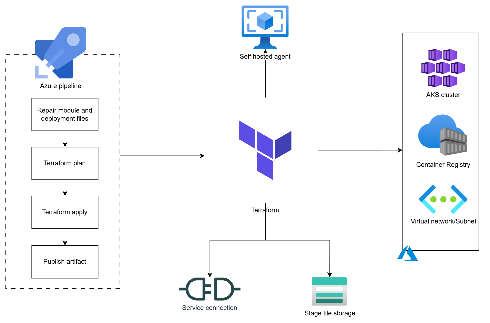
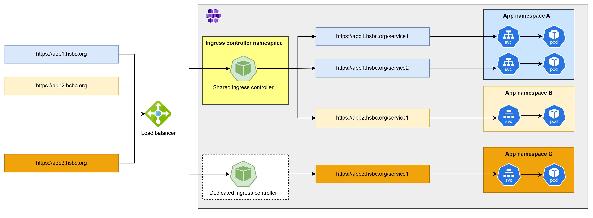

# 🚀 Terraform & Azure DevOps Pipeline for AKS Deployment  


## 👨‍💻 Author  

**Vo The Minh**  

- 🌐 **GitHub**: [https://github.com/18120211](https://github.com/18120211)  
- 💼 **LinkedIn**: [https://www.linkedin.com/in/minh-vo-108643118/](https://www.linkedin.com/in/minh-vo-108643118/)  
- 📧 **Email**: minhthevo123@gmail.com 

🚀 Passionate about **Kubernetes, DevOps, and Cloud Engineering**. Always learning and sharing knowledge!  
Feel free to connect! 😊 

## 📖 Table of Contents  
- [🌟 Overview](#overview)  
- [🔄 Workflow and Implementation](#workflow-and-implementation)  
  - [🏗️ 1. Infrastructure Provisioning (AKS, ACR and VNET)](#infrastructure-provisioning)  
  - [🚀 2. Application Deployment (Kubernetes + Ingress Controller)](#application-deployment)  
- [🚀 Future Enhancements](#future-enhancements)  


## 🌟 Overview  <a id="overview"></a>  

This project demonstrates how to automate infrastructure provisioning and application deployment on **Microsoft Azure** using **Terraform** and **Azure DevOps Pipelines**.  

### 🏗️ Infrastructure Components 

The following Azure resources are provisioned using **Infrastructure as Code (IaC)**:  

- 🏢 **Azure Kubernetes Service (AKS)** – Fully managed Kubernetes clusters.  
- 📦 **Azure Container Registry (ACR)** – Secure container image storage.  
- 🌐 **Virtual Network (VNET) & Subnets** – Secure networking for AKS and related services.  

---

### 🚢 Application Deployment 

Applications are deployed to AKS using the **Kubernetes Provider for Terraform**, ensuring a declarative and automated deployment process.  

🔀 **Traffic Routing:**  
- 🔒 **Dedicated Ingress Controller** – Used exclusively by applications within a specific namespace.  
- 🌍 **Shared Ingress Controller** – Available to all namespaces for broad accessibility.  

---

### 🎯 Key Features 

- ✅ **Infrastructure as Code (IaC)** – Terraform ensures repeatable, scalable, and version-controlled infrastructure.  
- ✅ **Automated CI/CD** – Seamless deployment via **Azure DevOps Pipelines**.  
- ✅ **Scalability & Security** – Secure networking and **Role-Based Access Control (RBAC)** for AKS.  
- ✅ **Ingress & Load Balancer** – Efficient traffic distribution using NGINX Ingress Controller and Azure Load Balancer.  

📌 This portfolio highlights best practices in **Kubernetes deployment, cloud automation, and DevOps methodologies**.  

📖 Stay tuned for more details in upcoming sections! 🚀  

$~$

## 🔄 Workflow and Implementation <a id="workflow-and-implementation"></a> 


### 🏗️ **1. Infrastructure Provisioning (AKS, ACR and VNET)**  <a id="infrastructure-provisioning"></a> 

Infrastructure is provisioned using **Terraform**, with automation managed through **Azure DevOps Pipelines**.



---

### 1️⃣ Terraform Configuration (`terraform/ folder`)

```bash
📂 terraform/
 ├── main.tf           # AKS, ACR, and networking resources  
 ├── variables.tf      # Input variables  
 ├── outputs.tf        # Output values  
 ├── providers.tf      # Azure provider configuration  
 ├── backend.tf        # Remote state storage  
```

#### 🔹 `providers.tf` (Configure Azure Provider)
```tf
terraform {
  required_providers {
    azurerm = {
      source  = "hashicorp/azurerm"
      version = "~> 3.0"
    }
  }

  backend "azurerm" {
    resource_group_name  = "terraform-state-rg"
    storage_account_name = "tfstateaccount"
    container_name       = "tfstate"
    key                  = "terraform.tfstate"
  }
}

provider "azurerm" {
  features {}
}
```

#### 🔹 `variables.tf` (Define Inputs)
```tf
variable "resource_group_name" { default = "aks-rg" }
variable "location" { default = "East US" }
variable "aks_cluster_name" { default = "myAKSCluster" }
variable "acr_name" { default = "myContainerRegistry" }
variable "vnet_name" { default = "aks-vnet" }
variable "subnet_name" { default = "aks-subnet" }
variable "node_count" { default = 2 }
```

#### 🔹`outputs.tf` (Expose Outputs)
```tf
output "aks_name" {
  value = azurerm_kubernetes_cluster.aks.name
}

output "acr_login_server" {
  value = azurerm_container_registry.acr.login_server
}

output "kube_config" {
  value     = azurerm_kubernetes_cluster.aks.kube_config_raw
  sensitive = true
}
```

---

### 2️⃣ Azure DevOps Pipeline (`azure-pipelines.yml`)

```yaml
trigger:
- main  # Trigger pipeline on code push to 'main' branch

pool:
  vmImage: ubuntu-latest

variables:
  RESOURCE_GROUP: "aks-rg"
  STORAGE_ACCOUNT: "tfstateaccount"
  CONTAINER_NAME: "tfstate"
  TF_STATE_FILE: "terraform.tfstate"

stages:
- stage: Terraform_Deploy
  displayName: "Terraform Deployment"
  jobs:
  - job: Terraform
    displayName: "Terraform Apply"
    steps:

    - task: TerraformInstaller@1
      displayName: "Install Terraform"
      inputs:
        terraformVersion: "1.5.0"

    - script: terraform init -backend-config="resource_group_name=$(RESOURCE_GROUP)" \
                             -backend-config="storage_account_name=$(STORAGE_ACCOUNT)" \
                             -backend-config="container_name=$(CONTAINER_NAME)" \
                             -backend-config="key=$(TF_STATE_FILE)"
      displayName: "Initialize Terraform"

    - script: terraform validate
      displayName: "Validate Terraform Configuration"

    - script: terraform plan -out=tfplan
      displayName: "Terraform Plan"

    - script: terraform apply -auto-approve tfplan
      displayName: "Terraform Apply"

    - task: AzureCLI@2
      displayName: "Retrieve AKS Credentials"
      inputs:
        azureSubscription: "<your-service-connection>"
        scriptType: bash
        scriptLocation: inlineScript
        inlineScript: |
          az aks get-credentials --resource-group $(RESOURCE_GROUP) --name $(AKS_CLUSTER_NAME) --overwrite-existing
```

🔹 **Outcome:** Fully provisioned **AKS cluster, ACR, networking, and security configurations**.  

---

### 🚀 **2. Application Deployment (Kubernetes + Ingress Controller)** <a id="application-deployment"></a>   

Once the infrastructure is provisioned, applications are deployed to **AKS** using **Terraform Kubernetes Provider**.



---

### 1️⃣ Kubernetes Manifests (`k8s-manifests/ folder`)

### This setup includes:
- ✅ Deployment – Deploys a sample app.
- ✅ Service – Exposes the app inside the cluster.
- ✅ Ingress Controller (NGINX) – Manages external traffic.
- ✅ Ingress Resource – Routes traffic to the app.

---

### 📂 Folder Structure
```bash
📂 k8s-manifests/
 ├── deployment.yaml         # Application Deployment & Service
 ├── ingress-controller.yaml # NGINX Ingress Controller
 ├── ingress.yaml            # Application Ingress
```

#### 🔹 `deployment.yaml` (App Deployment & Service)
```yaml
apiVersion: apps/v1
kind: Deployment
metadata:
  name: my-app
  namespace: default
spec:
  replicas: 2
  selector:
    matchLabels:
      app: my-app
  template:
    metadata:
      labels:
        app: my-app
    spec:
      containers:
      - name: my-app
        image: myacr.azurecr.io/my-app:v1  # Replace with your ACR image
        ports:
        - containerPort: 80
---
apiVersion: v1
kind: Service
metadata:
  name: my-app-service
  namespace: default
spec:
  selector:
    app: my-app
  ports:
    - protocol: TCP
      port: 80
      targetPort: 80
  type: ClusterIP
```

#### 🔹 `ingress-controller.yaml` (NGINX Ingress Controller)
```yaml
apiVersion: helm.cattle.io/v1
kind: HelmChart
metadata:
  name: nginx-ingress
  namespace: kube-system
spec:
  chart: stable/nginx-ingress
  targetNamespace: kube-system
  set:
    controller.replicaCount: "2"
    controller.service.type: "LoadBalancer"
```

#### 🔹 `ingress.yaml` (Application Ingress Resource)
```yaml
apiVersion: networking.k8s.io/v1
kind: Ingress
metadata:
  name: my-app-ingress
  namespace: default
  annotations:
    kubernetes.io/ingress.class: "nginx"
spec:
  rules:
  - host: myapp.example.com  # Replace with your domain
    http:
      paths:
      - path: /
        pathType: Prefix
        backend:
          service:
            name: my-app-service
            port:
              number: 80
```

---

### 2️⃣ Azure DevOps Pipeline (`azure-pipelines.yml`)

### This pipeline:
- ✅ Deploys Ingress Controller using Helm.
- ✅ Deploys the Application & Service.
- ✅ Creates an Ingress Resource.

```yaml
trigger:
- main  # Run on push to main branch

pool:
  vmImage: ubuntu-latest

variables:
  KUBE_NAMESPACE: "default"

stages:
- stage: Deploy
  displayName: "Deploy to AKS"
  jobs:
  - job: Kubernetes_Deploy
    displayName: "Deploy Ingress Controller and Application"
    steps:

    - task: KubernetesManifest@0
      displayName: "Deploy Ingress Controller"
      inputs:
        action: deploy
        kubernetesServiceConnection: "<your-azure-k8s-connection>"
        namespace: "kube-system"
        manifests: "k8s-manifests/ingress-controller.yaml"

    - task: KubernetesManifest@0
      displayName: "Deploy Application"
      inputs:
        action: deploy
        kubernetesServiceConnection: "<your-azure-k8s-connection>"
        namespace: "$(KUBE_NAMESPACE)"
        manifests: |
          k8s-manifests/deployment.yaml
          k8s-manifests/ingress.yaml
```

### 🎯 What This Setup Does
- ✅ Deploys NGINX Ingress Controller as a LoadBalancer.
- ✅ Deploys Application & Service in AKS.
- ✅ Configures Ingress Rules to route traffic to the app.
- ✅ Uses Azure DevOps Pipelines to automate deployment.

$~$

## 🚀 Future Enhancements  <a id="future-enhancements"></a> 

To improve scalability, security, and efficiency, the following enhancements are planned for this project:  

### 🔐 **Security & Authentication**  
- ✅ **TLS/SSL Encryption** – Integrate **Let's Encrypt** or **Azure Application Gateway** for HTTPS.  
- ✅ **Azure AD Integration** – Implement **AAD Pod Identity** for secure authentication.  
- ✅ **Network Policies** – Restrict communication between pods for improved security.  

### 📈 **Scalability & Performance**  
- ⚡ **Horizontal Pod Autoscaling (HPA)** – Automatically scale applications based on CPU/memory usage.  
- ⚡ **Cluster Autoscaler** – Adjust AKS node count based on workload demands.  
- 🌎 **Global Traffic Management** – Use **Azure Front Door** for global load balancing.  

### 📊 **Monitoring & Logging**  
- 📡 **Azure Monitor & Log Analytics** – Track AKS performance and logs.  
- 📊 **Prometheus & Grafana** – Implement real-time dashboards for cluster monitoring.  
- 🔍 **Jaeger & OpenTelemetry** – Distributed tracing for microservices observability.  

### 🔄 **DevOps & Automation**  
- 🔁 **GitOps with ArgoCD** – Automate deployments using Git-based workflows.  
- 📜 **Helm Charts** – Package Kubernetes manifests for modular deployments.  
- 🛠 **Policy Enforcement with OPA (Open Policy Agent)** – Enforce security policies in Kubernetes.  

### 🏗 **Infrastructure Improvements**  
- ☁️ **Multi-Cluster Support** – Deploy applications across multiple AKS clusters.  
- 🏢 **Multi-Tenant Ingress** – Separate ingress controllers for different teams/projects.  
- 🌐 **Service Mesh (Istio/Linkerd)** – Implement microservices networking for better traffic control.  

By implementing these enhancements, the project will achieve **higher security, better scalability, and improved observability**! 🚀  
